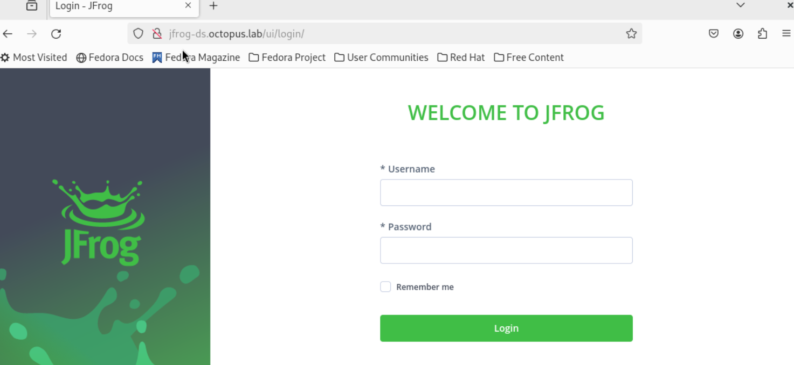
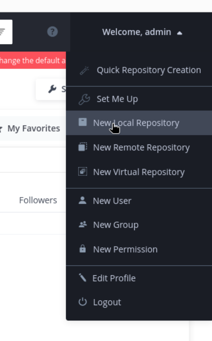
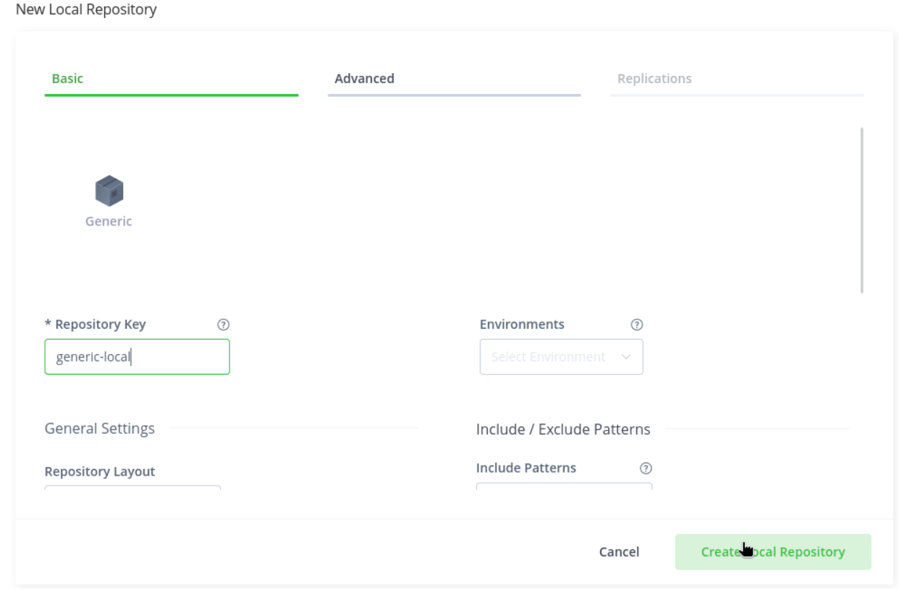

# Introduction
In this project we will use a simple api python app, and deploy it in k8s. We will learn and use Jfrog artifactory to store our image, and use Ansible to automate the whole environmental installation and deployment<br><br>

# Prerequisites
* Python
* Docker
* Ansible
* Kubectl
* Python scripting knowladge
* Basic Kubernetes and Helm knowladge
* Basic understanding of Ansible
* **Note: everything in this article is suitable for Linux machines, especially Red Hat.**<br><br>

# Python API App
## Setting up a virtual environment
```
# To create a new environment run the command:
$ python -m venv .venv

# To activate and enter the environment run:
$ source .venv/bin/activate

# To install the flask package run:
$ pip install flask
```

# Ansible
## Creating The Roles
```
# Creating roles
$ ansible-galaxy init setup-role
$ ansible-galaxy init jfrog-role
$ ansible-galaxy create artifactory-role
$ ansible-galaxy init application-role

# Create the vault file
$ ansible-vault create vault.yaml
```

## Running Playbooks
```
# Running the first playbook
$ ansible-playbook setup.yaml
```

## Accessing the Jfrog UI
After some time, the jfrog pod will be up, and we will able to connect to the jfrog ui.
The screen below is the first window you will encounter. You can login using the default username: admin and the default password: password.



Then you should click on the right side to reate a new local repository.



Then, create a new generic repository and name it generic-local.
Note: you can name the repo wahtever you want just make sure to use it correctly in your files later on.



## Run The App
```
$ ansible-playbook run-app.yaml
```


