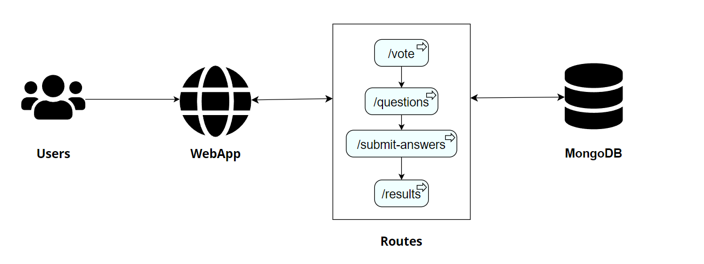

# Introduction
In this project we will dive into creating a simple voting app using Python, deploying it in a k8s cluster with helm, and create one important bash script to create the automation process. To create the python app we will use Flask + HTML + CSS for the frontend and mongodb for the backend, we will use kind for our k8s environment. Kind demonstrates us a full k8s cluster environment.<br><br>

# Prerequisites
* Python (Check out Python installation guide)<br>
* Docker (Check out Docker installation guide)<br>
* Python and Bash scripting knowladge<br>
* Basic Kubernetes and Helm knowladge<br>
* **Note: everything in this project is suitable for Linux machines, especially Red Hat.**<br><br>

# Python Voting App
## Setting up a virtual environment
```
# To create a new environment run the command:
$ python3 -m venv .venv

# To activate and enter the environment run:
$ source .venv/bin/activate

# For developing the app
 $ pip install Flask

# For the connection between the app and MongoDB
$ pip install pymongo
```

# Creating Dockerfile
```
# Run the command:
$ docker build -t vote-app-image .

# To check the new image run:
$ docker images

$ docker tag vote-app-image:latest dshwartzman5/vote-app
$ docker push dshwartzman5/vote-app

# Add the image to the deployment file of the app
```

# Run the script
```
# Give permmisions
$ sudo chmod 700 ./app-creation

# Run the script
$ sudo ./app-creation
```



